# Specification

> The Secure AI Code Library defines an IDE-agnostic, secure-by-design AI control plane for the SDLC. This document is the **normative specification**: scope, contracts, acceptance criteria, explicit out-of-scope, and the registry / rule versioning policy.

The single canonical view of how the parts fit together is the **AI Control Map**: see [`docs/AI-CONTROL-MAP.md`](./docs/AI-CONTROL-MAP.md) for the swim-lane diagram and traceability table. Readers of this spec should open that diagram in a second tab; everything below is the formal contract behind it.

```mermaid
%%{init: { 'theme': 'neutral' }}%%
flowchart LR
  accTitle: SPEC overview - library surfaces and gates
  accDescr: Three concentric surfaces - registry inner, adapters middle, gates outer - showing how the library lowers canonical YAML rules to IDE-specific formats and into pre-commit and CI gates.
  subgraph Reg["registry/ — canonical YAML (SoT)"]
    R1["rules/*.rule.yaml"]
    R2["subagents/<id>/subagent.yaml + run.sh"]
    R3["framework-specs/*.spec.yaml"]
    R4["schemas/*.schema.json"]
    R5["INDEX.md (auto)"]
  end
  subgraph Adp["adapters/ — IDE lowering"]
    A1[".cursor/rules + skills"]
    A2[".github/copilot-instructions.md"]
    A3["AGENTS.md sections"]
  end
  subgraph Gate["hooks/ + CI — gates"]
    G1["pre-commit.sh"]
    G2["registry-ci.yml"]
    G3["merge-gate.yml"]
    G4["source-hygiene.yml"]
    G5["Manthan scan-gate (POST /v1/events/commit)"]
  end
  Reg --> Adp
  Reg --> Gate
  Adp --> Gate
```

> See [`docs/AI-CONTROL-MAP.md`](./docs/AI-CONTROL-MAP.md) for the full traceability table.

---

## 1. Scope

### 1.1 In scope

The library defines, ships, and CI-validates:

1. **A canonical YAML rule registry** (`registry/rules/`) covering AI governance, coding standards (cross-language + per-language), policies, and pre-commit checks. Schema-validated; required `summary` ≤300 chars; required non-empty `sources.primary`; required `mythos_alignment.substantiation` ∈ {`substantiated`, `aligned`, `roadmap`}.
2. **Three IDE adapters** under `adapters/`: Cursor, Copilot (top-level INDEX only), AGENTS.md. Claude Code and Windsurf adapters are roadmapped to Phase 8 milestone M8.
3. **Six secure-by-design subagents** under `registry/subagents/<id>/` with two-tier execution (Tier A native agentic and Tier C headless deterministic runner). Tier B chat-prompt fallback is deliberately not shipped (see ADR 0004).
4. **A single pre-commit / CI hook** (`hooks/pre-commit.sh`) and config (`hooks/config.yaml`) that invokes subagent runners and a Manthan scan-gate.
5. **A Manthan scan-before-merge contract** documented in [`docs/MANTHAN-CONTRACT.md`](./docs/MANTHAN-CONTRACT.md). No Manthan code is bundled.
6. **Token-economy controls**: two-layer rule loading (summary always-on, content on-demand), token budgets per subagent (CI-enforced via `tiktoken`), cache-stable field ordering, scoped activation via globs.
7. **Provenance and attribution controls**: Co-Authored-By trailer verification for AI-flagged commits; runtime audit log at `.securecode/audit.log` (JSON-lines).
8. **Governance anchors**: [`CONSTITUTION.md`](./CONSTITUTION.md), this spec, [`THREAT_MODEL.md`](./THREAT_MODEL.md), 5 ADRs.
9. **Operational docs**: [`docs/MYTHOS.md`](./docs/MYTHOS.md), [`docs/SOURCES.md`](./docs/SOURCES.md), [`docs/INSTALL.md`](./docs/INSTALL.md), [`docs/MANTHAN-CONTRACT.md`](./docs/MANTHAN-CONTRACT.md), [`docs/SUBAGENT-FLOWS.md`](./docs/SUBAGENT-FLOWS.md), [`docs/TOKEN-ECONOMICS.md`](./docs/TOKEN-ECONOMICS.md), [`docs/EXTERNAL-RESOURCES.md`](./docs/EXTERNAL-RESOURCES.md).
10. **CI workflows**: `registry-ci.yml`, `merge-gate.yml`, `source-hygiene.yml`, plus the existing `jekyll-gh-pages.yml` (preserved and extended in Phase 6).
11. **A static documentation site** (Phase 7) served from the same repository via the existing `index.html` SPA + `js/markdown-loader.js`.

### 1.2 Out of scope

The library deliberately does **not** ship the following. These are tracked as roadmap items in [`docs/MYTHOS.md`](./docs/MYTHOS.md) § Roadmap.

| Out of scope | Why | Roadmap milestone |
|---|---|---|
| **Runtime telemetry** (MTTD, MTTR, coverage dashboards, OpenTelemetry exporters) | Requires deployed infrastructure; library is build-time + commit-time only. | M1 |
| **Incident response runbooks, kill-switch drills, tabletops** | Operational, not configurational. Library defines the controls; operators run the drills. | M2 |
| **SLSA L3 attestation pipeline, Sigstore signing, VEX, auto-remediation bots** | Out-of-tree CI infrastructure; library ships only the SBOM format and freshness policy. | M3 |
| **Time-to-patch SLA enforcement** | Requires ticketing system integration. | M4 |
| **AI-augmented defense pilots** (autonomous triage, auto-fix) | Library ships reviewer subagents, not autonomous defenders. | M5 |
| **Workforce training drill calendars, competency rubrics, game-day kits** | Programme management, not control configuration. | M6 |
| **Third-party assessment, public attestation, conformance badge programme** | Requires an assessment body. Library ships self-attestation only. | M7 |
| **Claude Code + Windsurf IDE adapters** | Adapter design is mechanical once the two-tier subagent contract is shipped; deferred for v1 surface area. | M8 |
| **Intermediate Representation (IR) of rules** | A reified AST of the rule content; not needed for v1 lowering. | — |
| **Bundled metrics / dashboards** | See M1; library ships only the audit-log JSON-lines format. | M1 |
| **Tier B chat-prompt fallback for subagents** | Native + headless covers every supported runtime context. Copilot Chat users read the generated SKILL.md or invoke the headless runners. | Not roadmapped; see ADR 0004. |
| **Per-framework Copilot mirror files** | Cost / value ratio too poor; framework spec sheets + reviewer subagent cover the same surface. | Not roadmapped. |
| **A separate `registry/skills/` tree** | Subagents are the single source of truth; per-IDE skills are adapter output. | Not roadmapped. |
| **`registry/.integrity.json`** | Git already provides content integrity. | Not roadmapped. |

---

## 2. Contracts

### 2.1 Rule file contract

Every file under `registry/rules/**/*.rule.yaml` MUST validate against [`registry/schemas/rule.schema.json`](./registry/schemas/rule.schema.json). The schema enforces (informally):

- `metadata.id` — kebab-case; matches the filename without `.rule.yaml`.
- `metadata.name` — human-readable.
- `summary` — string, **≤300 chars**, required. This is the always-on Layer 1 surface (see [`docs/TOKEN-ECONOMICS.md`](./docs/TOKEN-ECONOMICS.md)).
- `sources.primary` — non-empty array of strings citing primary standards or dated public threat-intel sources (per [`docs/SOURCES.md`](./docs/SOURCES.md)).
- `mythos_alignment.substantiation` — one of `substantiated`, `aligned`, `roadmap`.
- `content` — full markdown body. On-demand (Layer 2).
- `extends` — optional. If present, references a parent rule ID; the consumer-side adapter merges `summary`/`content` with the parent (parent first).

Other optional fields (`asvs_controls`, `iso_controls`, `iso42001_controls`, `nist_ai_rmf`, `cwe`, `mitre_atlas`, `scope`, `enforcement`, `severity`, `metadata.tags`, `metadata.languages`) are documented in the schema and in [`CONTRIBUTING.md`](./CONTRIBUTING.md).

### 2.2 Subagent contract

Every directory under `registry/subagents/<id>/` MUST contain:
- `subagent.yaml` validating against [`registry/schemas/subagent.schema.json`](./registry/schemas/subagent.schema.json) — declares `tiers.{native,headless}`, `token_budget.{input_max,output_max,warn_at}`, `audit_log.{enabled,path}`, `tool_scope`, optional `references.rules`.
- `run.sh` — POSIX shell, deterministic by default. May call `$SECUREAI_LLM_ENDPOINT` for prose remediation only when set; never for gating decisions.

Tier B chat-prompt files MUST NOT exist under `registry/subagents/`.

### 2.3 Framework spec contract

Every file under `registry/framework-specs/*.spec.yaml` MUST validate against [`registry/schemas/framework-spec.schema.json`](./registry/schemas/framework-spec.schema.json). Spec sheets carry framework-specific metadata that language rules cannot infer (CSRF middleware names, default cookie settings, template autoescape defaults, secret-loading conventions).

### 2.4 Adapter contract

Each adapter under `adapters/<ide>/` MUST be a directory containing an installer script (the global installer is `adapters/install.sh`) plus a lowering routine that:
1. Reads `registry/INDEX.md` and the canonical YAML files.
2. Writes to the IDE's expected location (`.cursor/rules/<id>.mdc`, `.github/copilot-instructions.md`, `AGENTS.md` sections).
3. Never inlines full rule `content` into always-on context — only `summary`.
4. Is idempotent: re-running `install.sh` produces a byte-identical output for the same registry state.

### 2.5 Hook contract

`hooks/pre-commit.sh` is a **single script** for both pre-commit and CI. It detects context via the `CI` environment variable. Sequence is documented in [`docs/MANTHAN-CONTRACT.md`](./docs/MANTHAN-CONTRACT.md). The script:
1. Runs the seven compliance checks (constitution, spec, sbom, adr, threat-model, freshness, gaps-risk).
2. Invokes the Tier C runners for `ai-governance-auditor` and `coding-standards-reviewer`.
3. Calls the Manthan scan-gate at `$manthan_endpoint/v1/events/commit`.
4. Merges findings and applies `severity_threshold` from `hooks/config.yaml`.
5. Exits non-zero when GAPS ≥ threshold; emits SARIF to stdout when `--format=sarif`.
6. Appends a JSON-lines entry to `.securecode/audit.log` per invocation.

### 2.6 Manthan contract

Documented in [`docs/MANTHAN-CONTRACT.md`](./docs/MANTHAN-CONTRACT.md). The library does not ship Manthan; it documents the endpoints (`POST /v1/scan`, `POST /v1/events/commit`, `/mcp/sse`, `/mcp/call`) and exit-code mapping. Manthan upstream: <https://github.com/arvindiyu/manthan>.

### 2.7 Token-economy contract

Documented in [`docs/TOKEN-ECONOMICS.md`](./docs/TOKEN-ECONOMICS.md) and ADR 0005. Key invariants:
- Every rule has `summary` ≤300 chars (CI-blocking).
- Every subagent declares `token_budget`; CI warns at 80% of declared budget.
- Field ordering is frozen by schema (cache-stability invariant).
- Per-language rules `extends:` cross-language rules; framework specs `extends:` language rules.

### 2.8 Audit log contract

`.securecode/audit.log` is a JSON-lines file appended by subagents at runtime. The library defines the format only; consumer projects gitignore the file in their own repos. Mandatory fields per entry: `timestamp` (RFC 3339), `subagent_id`, `tier` (`A`/`C`), `user`, `inputs_hash` (SHA-256), `model` (or `null` if Tier C and no LLM), `token_in`, `token_out`, `decision` (`pass`/`block`/`warn`), `finding_count`.

---

## 3. Acceptance criteria

The library is "v1.0.0" when **all** of the following are true:

### 3.1 Repository structure

- [x] Phase 1 governance anchors authored: `README.md`, `CONSTITUTION.md`, `SPEC.md`, `THREAT_MODEL.md`, `AGENTS.md`, `CONTRIBUTING.md`, `SECURITY.md`, `CHANGELOG.md`, `Makefile`, `sbom.cdx.json`.
- [x] Phase 1 docs authored: `docs/AI-CONTROL-MAP.md`, `docs/MYTHOS.md`, `docs/SOURCES.md`, `docs/INSTALL.md`, `docs/MANTHAN-CONTRACT.md`, `docs/SUBAGENT-FLOWS.md`, `docs/TOKEN-ECONOMICS.md`, `docs/EXTERNAL-RESOURCES.md` (Phase 5 fills the content).
- [x] 5 ADRs seeded under `docs/adr/`.
- [x] 4 JSON Schemas under `registry/schemas/`.
- [x] Empty placeholder directories created with `.gitkeep`.

### 3.2 Registry content (Phase 2)

- [ ] 20 baseline AI-governance rules shipped.
- [ ] 2 Mythos-era AI-governance rules added (`llm-output-sanitization`, `ai-kill-switch`).
- [ ] 14 cross-language coding-standards rules ported.
- [ ] 10 per-language coding-standards rules ported using `extends:`.
- [ ] 6 policy rules created.
- [ ] 9 pre-commit rules created (including `ai-attribution-check` blocking by default).
- [ ] `registry/INDEX.md` auto-generated.

### 3.3 Adapters and subagents (Phase 3)

- [ ] 3 adapters created with `install.sh`.
- [ ] 6 subagent directories created with `subagent.yaml` + `run.sh`.

### 3.4 Hook + Manthan (Phase 4)

- [ ] `hooks/pre-commit.sh` + `hooks/config.yaml` created.
- [ ] `docs/MANTHAN-CONTRACT.md` filled with endpoint contracts, severity matrix, freshness definition.

### 3.5 Catalog closure (Phase 5)

- [ ] `docs/EXTERNAL-RESOURCES.md` populated.
- [ ] 12 framework spec sheets created.
- [ ] 3 net-new bespoke prompts authored.
- [ ] All `[WIP]` markers in `index.html` resolved.

### 3.6 CI (Phase 6)

- [ ] `registry-ci.yml`, `merge-gate.yml`, `source-hygiene.yml` workflows authored.
- [ ] Token-budget lint passes for all subagents and rules.
- [ ] Cross-link lint passes.

### 3.7 Site (Phase 7)

- [ ] `index.html` updated.
- [ ] `_config.yml` updated with exclude list + defaults: layout: null.
- [ ] `js/yaml-loader.js`, `js/search-index.json`, `css/site.css` created.

---

## 4. Registry and rule versioning policy

This section is normative. Adapter and subagent contracts depend on it.

### 4.1 Library version

The library version is recorded in [`CHANGELOG.md`](./CHANGELOG.md). Bumps follow **semantic versioning**:

- **MAJOR** — Breaking change to any contract in §2 above (rule schema, subagent schema, framework-spec schema, hook script signature, audit-log fields, adapter output filenames).
- **MINOR** — New rule, new subagent, new framework spec, or new policy added without modifying existing schemas.
- **PATCH** — Content-only changes inside existing rules (markdown body, examples, citations).

### 4.2 Rule version

Each rule file's `version` field (under `metadata.version` in v2) follows semver against the rule's content contract:
- **MAJOR** — Changed `summary` semantic (re-trains agents on a different intent), new required `extends` parent, removed asvs/iso/nist mapping.
- **MINOR** — Added asvs/iso/nist mapping, added BAD/GOOD example, expanded `metadata.tags`.
- **PATCH** — Typo, citation re-wording, link refresh.

### 4.3 Schema version

JSON Schemas under `registry/schemas/` carry their own `$id` URL with a version segment. A breaking schema change requires:
1. New schema file (or new `$id` major version).
2. Migration note in `CHANGELOG.md`.
3. Optional codemod in `adapters/` if rule files can be auto-updated.

### 4.4 Pinning

Adapters lower the current main of `registry/` by default. Consumer projects pin to a tag (e.g., `v1.0.0`) via the install snippet documented in [`docs/INSTALL.md`](./docs/INSTALL.md).

### 4.5 Deprecation policy

A rule may be deprecated by adding `deprecated: true` and `deprecated_in: <library version>` to its frontmatter. Deprecated rules remain in `registry/INDEX.md` with a `(deprecated)` suffix for at least one MINOR cycle before removal, to give adapters and consumers a migration window.

---

## 5. Conformance levels

A consumer project is "Mythos-Aligned Foundation conformant" when:

1. It runs `hooks/pre-commit.sh` (or equivalent CI) on every commit / PR.
2. Its `hooks/config.yaml` declares `severity_threshold` at `high` or stricter.
3. It enables the `ai-attribution-check` pre-commit rule (blocking).
4. It includes a CONSTITUTION-like governance anchor referencing the same primary standards.
5. It runs the `ai-governance-auditor` + `coding-standards-reviewer` subagent Tier C runners (zero LLM cost) on every PR.

Self-attestation only at this level — third-party conformance assessment is roadmapped to M7.

---

## 6. References

- [`CONSTITUTION.md`](./CONSTITUTION.md) — control mappings.
- [`THREAT_MODEL.md`](./THREAT_MODEL.md) — STRIDE per trust boundary.
- [`docs/AI-CONTROL-MAP.md`](./docs/AI-CONTROL-MAP.md) — swim-lane diagram + traceability table.
- [`docs/MYTHOS.md`](./docs/MYTHOS.md) — alignment matrix + roadmap.
- [`docs/TOKEN-ECONOMICS.md`](./docs/TOKEN-ECONOMICS.md) — token-economy details.
- [`docs/MANTHAN-CONTRACT.md`](./docs/MANTHAN-CONTRACT.md) — Manthan endpoint contracts.
- ADR 0001 through ADR 0005 — design decisions backing this spec.
