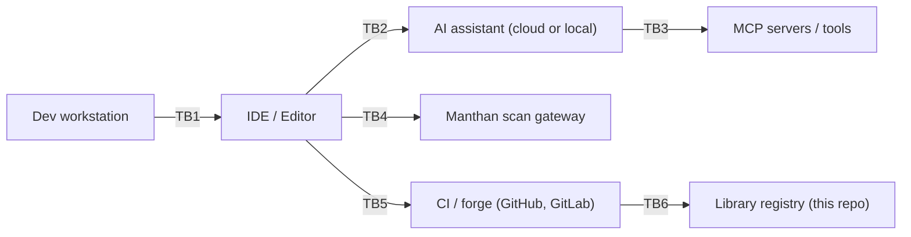

# Threat Model

> This document is the STRIDE threat model for the Secure AI Code Library itself — the **artefact**, not consumer projects that adopt it. It enumerates trust boundaries along the AI-assisted SDLC, threats per boundary, mitigations the library ships today, and the residual posture (the "Glasswing-era" section) under a model-capability tier that can synthesise plausible-looking attack code from minimal prompts.

Methodology follows STRIDE (Spoofing, Tampering, Repudiation, Information disclosure, Denial of service, Elevation of privilege) applied to each trust boundary on the data-flow path between developer keystroke and merged commit. References use dated public sources only, per [`docs/SOURCES.md`](./docs/SOURCES.md).

## Trust boundaries

| ID | Boundary crossed | Crossing direction | Notes |
|---|---|---|---|
| **TB1** | Dev workstation → IDE process | bidirectional | Local OS process boundary. |
| **TB2** | IDE → AI assistant | bidirectional, network | TLS to cloud endpoint or loopback to local model. |
| **TB3** | AI assistant → MCP tool servers | bidirectional, network | Often loopback or LAN; sometimes cloud. |
| **TB4** | IDE → Manthan ASOC gateway | bidirectional, network | Typically loopback. |
| **TB5** | IDE → CI forge | unidirectional (push) | TLS to GitHub / GitLab / Bitbucket. |
| **TB6** | CI → library registry | read-only (clone / fetch) | Public artefact distribution. |

---

## Threats by boundary

### TB1 — Dev workstation → IDE process

| STRIDE | Threat | Mitigation in library | Residual risk |
|---|---|---|---|
| **S** | Malicious extension impersonates the library's adapter, replaces `.cursor/rules/*.mdc`. | `adapters/install.sh` is reproducible; CI can recompute byte-identical output from `registry/` and diff it. | Detection only; runtime tampering not prevented. |
| **T** | Tampered local clone of the library (registry rule swapped, severity weakened). | Git provides content integrity; `registry-ci.yml` (Phase 6) re-runs schema validation on every PR. | Local checkout integrity is the consumer's responsibility. |
| **R** | Developer disables pre-commit hook to push unreviewed AI code. | `merge-gate.yml` (Phase 6) re-runs `hooks/pre-commit.sh` in CI on every PR — eats own dogfood. | Consumer projects must also wire `merge-gate.yml`. |
| **I** | Audit log (`.securecode/audit.log`) leaks PII from `inputs_hash` field. | Audit-log spec uses SHA-256 of inputs, not inputs themselves; `ai-audit-logging` rule (Phase 2) mandates this. | Operators may accidentally log raw inputs; doc-only mitigation. |
| **D** | Hook script hangs and blocks commit indefinitely. | `hooks/pre-commit.sh` (Phase 4) sets timeouts on subagent runners; Manthan call has connect-timeout. | Misconfigured Manthan endpoint can still slow commits; documented in `INSTALL.md`. |
| **E** | Subagent Tier C runner sources untrusted code (e.g., curl pipe-to-shell). | Tier C runners are POSIX shell using `rg`, `yq`, `jq` only; no network calls unless `SECUREAI_LLM_ENDPOINT` set (opt-in). `tool_scope.denied: [network, shell]` declared in `subagent.yaml`. | If consumer overrides `tool_scope`, all bets off. |

### TB2 — IDE ↔ AI assistant

| STRIDE | Threat | Mitigation in library | Residual risk |
|---|---|---|---|
| **S** | Prompt injection via repository content tricks the assistant into ignoring rules. | `prompt-injection-prevention` rule (Tier 0, always-on) + `llm-output-sanitization` rule scoped to LLM-output handling. | Detection-leaning; cannot prevent novel injection payloads. See [OWASP Top 10 for LLM Applications LLM01 (2025)](https://genai.owasp.org/llm-top-10/). |
| **T** | Model output silently rewrites a security-relevant file without producing a diff a reviewer would notice. | `ai-code-provenance` + `ai-attribution-check` (BLOCKING) require Co-Authored-By trailer on AI-flagged commits — diff cannot land without provenance. | Trailer is metadata; can be forged by a determined committer (matter for governance, not the library). |
| **R** | Assistant produces guidance that violates a policy but no audit record exists. | `ai-audit-logging` rule (Tier 0, always-on) mandates JSON-lines audit. Subagent `audit_log` spec is required in schema. | Audit log is local-file; aggregation is a roadmap item (M1). |
| **I** | Sensitive repo content sent to a cloud model via the IDE's context. | `agentic-tool-scoping` rule constrains what subagent runners are allowed to read; pre-commit hook can scrub if configured. | Library cannot control native IDE context; doc-only guidance. |
| **D** | Cloud model rate-limits or 429s during a commit. | Tier C headless runners do not require an LLM endpoint by default — pre-commit succeeds without cloud connectivity. | Tier A native agentic flows still depend on the assistant's availability. |
| **E** | Tool-use call from the assistant triggers a privileged operation outside the agreed scope. | `agentic-action-classification` + `agentic-human-approval` rules + `tool_scope` enforcement in subagent.yaml. | Trust in IDE's tool-call filtering; the library defines policy, not enforcement. |

### TB3 — AI assistant ↔ MCP server

| STRIDE | Threat | Mitigation in library | Residual risk |
|---|---|---|---|
| **S** | Rogue MCP server impersonates a trusted tool (typosquatted name). | `mcp-server-safety` rule (Tier 0, always-on) lists allow-list patterns; `mcp-builder` subagent scaffolds servers with that contract. | Detection lags introduction of new MCP servers. |
| **T** | MCP server modifies returned data to inject instructions. | `llm-output-sanitization` rule treats all MCP responses as untrusted input. | Cannot detect content-level tampering without semantic check. |
| **R** | MCP server logs missing for compliance review. | `mcp-builder` scaffold emits structured logs by default. | Consumer-deployed MCP servers may opt out. |
| **I** | MCP server gains read access to the entire workspace via a wide tool scope. | `agentic-tool-scoping` + `mcp-server-safety` define explicit `tool_scope.allowed` / `tool_scope.denied`. | Adapter cannot enforce at the IDE level; the IDE's tool-permission UI is the only true gate. |
| **D** | Malicious MCP server returns 200KB of context-poison on every call. | `token_budget.context_max` per subagent caps consumed context. | Token budgets are CI-warn only at 80%, not runtime-hard-block. |
| **E** | MCP server uses OBO-auth to escalate caller's identity to write to a privileged store. | `agentic-obo-auth` rule mandates audience-bound tokens with scope. | Consumer infrastructure controls token issuance; library only documents policy. |

### TB4 — IDE ↔ Manthan

| STRIDE | Threat | Mitigation in library | Residual risk |
|---|---|---|---|
| **S** | Local DNS poisoning routes `localhost:8080` to a rogue scanner that always returns "pass". | Manthan endpoint in `hooks/config.yaml` is explicit; consumer can pin to a Unix socket or restrict to loopback. | Library cannot validate the scanner's identity. |
| **T** | Tampered Manthan response in transit. | TLS recommended for non-loopback; `MANTHAN-CONTRACT.md` (Phase 4) documents production patterns. | Plaintext loopback is acceptable in dev, not production. |
| **R** | Scan result missing for a merged commit. | `merge-gate.yml` (Phase 6) re-runs pre-commit in CI; cannot bypass via local config. | Consumer must wire the workflow. |
| **I** | Manthan finding includes the leaked secret string in plaintext. | `MANTHAN-CONTRACT.md` requires findings to redact the secret; Manthan is responsible for redaction. | External-system contract. |
| **D** | Manthan endpoint down → pre-commit hangs. | `pre-commit.sh` (Phase 4) sets connect-timeout 3s, total-timeout 30s; fails closed with a clear message. | Tunable in `hooks/config.yaml`. |
| **E** | Manthan endpoint returns "pass" for any payload due to misconfig. | `severity-thresholds` policy + GAPS classification rule re-checks the response shape; CI rejects malformed scan results. | Quality of Manthan deployment is out of scope. |

### TB5 — IDE → CI forge

| STRIDE | Threat | Mitigation in library | Residual risk |
|---|---|---|---|
| **S** | Forced-push bypasses required-status-check protections. | Library recommends branch-protection rules in `INSTALL.md`. Doc-only. | Consumer admin must configure forge. |
| **T** | Workflow file tampered to drop the scan-gate step. | `merge-gate.yml` is shipped as the canonical workflow; CODEOWNERS recommended. | Forge configuration is consumer responsibility. |
| **R** | Reviewer approves AI code without provenance trailer. | `ai-attribution-check` runs in CI as well as pre-commit; PR cannot pass status check. | None — this is hard-blocking. |
| **I** | Secrets in PR payload posted to forge. | Pre-commit `no-hardcoded-secrets` blocks before push. | Pre-commit bypassed → secret lands in PR; `merge-gate.yml` re-runs to catch it server-side. |
| **D** | CI runner congestion blocks merges. | Tier C runners are deterministic / fast; total CI cost is bounded by `token_budget.warn_at` checks. | Forge runner capacity is out of scope. |
| **E** | Self-hosted runner compromised → attacker rewrites artefacts. | Library recommends GitHub-hosted runners for security-critical workflows in `INSTALL.md`. | Doc-only. |

### TB6 — CI → library registry (this repo)

| STRIDE | Threat | Mitigation in library | Residual risk |
|---|---|---|---|
| **S** | Forked repo masquerades as upstream. | Consumers pin to upstream via tag or commit SHA. | Convention. |
| **T** | Rule file modified upstream to lower severity. | `registry-ci.yml` schema-validates every PR; `source-hygiene.yml` blocks vendor-announcement citations. | Maintainer review is the final gate. |
| **R** | Rule removed silently. | `CHANGELOG.md` (Keep-a-Changelog) + deprecation policy in `SPEC.md` §4.5. | Convention. |
| **I** | Internal threat-intel leaked into a public rule. | `source-hygiene.yml` requires every citation to be on the allowlist. | Reviewer discipline. |
| **D** | A malformed JSON Schema breaks every consumer build. | `registry-ci.yml` self-tests schemas against known-good fixtures. | Test coverage. |
| **E** | A new rule file lands with `enforcement.mode: advisory` but is later silently flipped to `blocking`. | Severity / mode changes require a MINOR or MAJOR version bump per `SPEC.md` §4.1. | Convention. |

---

## Glasswing-era threat posture

This section addresses the residual posture of the AI-assisted SDLC under a **model-capability tier** capable of synthesising plausible-looking attack code, vulnerable middleware substitutions, or convincing prompt-injection payloads from minimal scaffolding. The reference public capability framing for this tier is **Anthropic's "Project Glasswing" / Claude Mythos posture (as of 2026-06)** — treated here as **product context**, never as a threat-intel source for statistics.

Public, dated threat-intel sources we DO cite in this section:
- **Verizon Data Breach Investigations Report 2024**: increased attribution of "AI-assisted" credentialing and phishing (DBIR 2024 §Industry Insights).
- **Mandiant M-Trends 2024**: shorter dwell times against developer tooling supply chains.
- **CISA AA24-242A (2024)**: advisory on AI-assisted social engineering targeting build infrastructure.
- **ENISA Threat Landscape 2024**: AI-augmented attack surface category, published 2024-09.
- **MITRE ATLAS (2024)**: `AML.T0051` (LLM Prompt Injection), `AML.T0048` (Erode ML Model Integrity), `AML.TA0007` (Persistence).

### Posture statement

The Glasswing-era assumption is: **an attacker can generate code that compiles, passes lint, and looks idiomatic, but contains a vulnerability the human reviewer would have caught.** This shifts threat focus from "rare, hand-crafted malicious commits" to "high-volume, plausibly-styled, semi-correct code" — and amplifies four specific risks:

1. **Plausible-but-wrong cryptography.** A model is statistically likely to generate the most-googled crypto snippet (e.g., AES-ECB, MD5 for password storage), which compiles, runs, and is wrong. Mitigation: `coding-standards-reviewer` Tier C rules pattern-match high-risk crypto primitives independently of LLM judgement.
2. **Subtle deserialisation gadgets.** A model may produce Jackson, Pickle, or YAML deserialisation patterns that work in dev and exploit a gadget chain in prod. Mitigation: `secure-deserialization` rule (Phase 2) + framework-spec `extra_checks` for Spring Boot / Django / Rails.
3. **Look-alike supply chain dependencies.** A model can suggest a typosquatted package name with high confidence. Mitigation: `sbom-freshness` + `sbom-check` plus a Manthan SCA scan; library does not ship a typosquat blocklist itself but documents the dependency in `EXTERNAL-RESOURCES.md` (Phase 5).
4. **Indirect prompt injection via context.** A README, code comment, or fetched URL contains hidden instructions the assistant treats as authoritative. Mitigation: `prompt-injection-prevention` (Tier 0) + `llm-output-sanitization` + Tier C runners that do not consume LLM context at all by default.

### Strategies the library applies under this posture

- **Reduce LLM blast radius.** Subagent `tool_scope.allowed`/`denied` is narrow by default; `references.rules` is a closed set per subagent so an attacker cannot widen the rules an agent will load by stuffing a payload.
- **Decision determinism.** Tier C runners decide the gate. LLM (when enabled via `SECUREAI_LLM_ENDPOINT`) writes prose remediation only; it cannot upgrade a "block" to a "pass".
- **Provenance is hard-required.** `ai-attribution-check` is BLOCKING by default. Commits without a Co-Authored-By trailer attesting to AI assistance, when AI assistance was used, are rejected. This is doctrinal, not heuristic.
- **Cache stability frustrates context-poisoning churn.** Field ordering is frozen by schema, which both reduces token cost (per `docs/TOKEN-ECONOMICS.md`) and reduces the surface area for "did this commit change the rule contents?" tampering.
- **Audit-log everything.** `.securecode/audit.log` JSON-lines feed the M1 telemetry milestone. Even in v1, raw incident forensics is reconstructable from the log.

### What the library does NOT claim under this posture

- We do **not** claim red-team evaluation against Glasswing-class capability (would require demonstrated evaluation, not yet performed; see [`docs/MYTHOS.md`](./docs/MYTHOS.md) M5).
- We do **not** claim to detect novel prompt-injection payloads. We detect known patterns and provide structural mitigations (output sanitisation, narrow tool scopes).
- We do **not** ship runtime anomaly detection. M1 telemetry milestone is the path.

---

## References

- OWASP Top 10 for LLM Applications, 2025 edition: <https://genai.owasp.org/llm-top-10/>.
- MITRE ATLAS (as of 2024): <https://atlas.mitre.org/>.
- Verizon Data Breach Investigations Report 2024: <https://www.verizon.com/business/resources/reports/dbir/>.
- Mandiant M-Trends 2024: <https://cloud.google.com/security/resources/m-trends>.
- CISA Advisories (AA24-242A and later, 2024): <https://www.cisa.gov/news-events/cybersecurity-advisories>.
- ENISA Threat Landscape 2024: <https://www.enisa.europa.eu/topics/cyber-threats/threats-and-trends>.
- STRIDE — Microsoft Threat Modeling Tool documentation.
