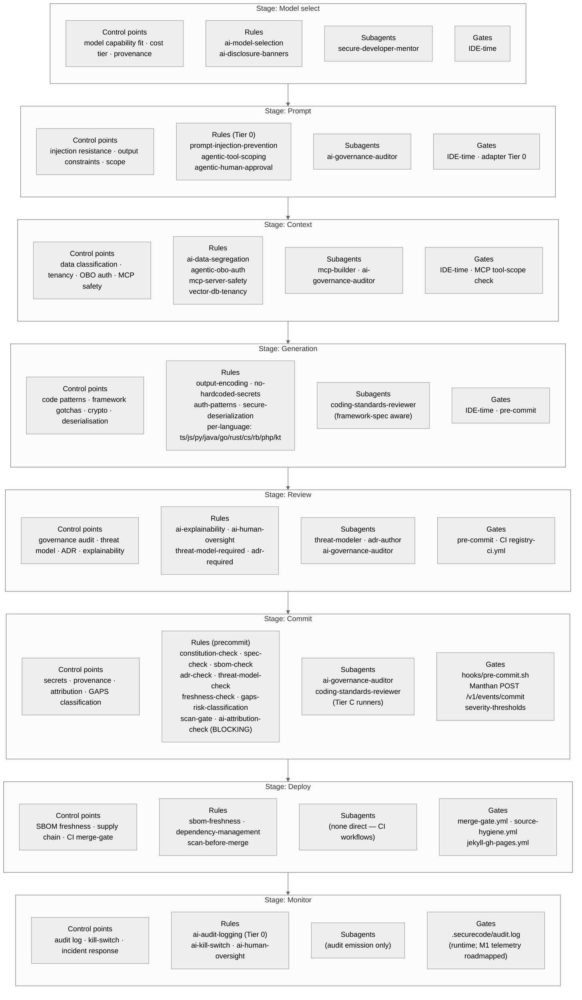

# AI Control Map

> The elevator pitch in one page. This document is the single most important artefact in the library — it is the swim-lane that every other document, rule, subagent, adapter, and gate ultimately references. Read this first.

The map answers one question: **"At every stage of the AI-assisted SDLC, which control point governs the work, which rule encodes the control, which subagent enforces it, and which gate ratifies it?"**

If a control claim cannot be traced through this map, it does not belong in the library.

## The swim-lane

## How to read the map

Each column above is one stage of the AI-assisted SDLC. Inside each column, the four rows are:

1. **Control points** — what we are actually trying to govern at this stage.
2. **Rules** — the canonical YAML files in `registry/rules/` that encode each control.
3. **Subagents** — the agents (under `registry/subagents/<id>/`) that enforce the rules at this stage.
4. **Gates** — where ratification happens: IDE-time, pre-commit (`hooks/pre-commit.sh`), CI workflows, the Manthan scan-gate, or runtime audit.

Tier 0 rules (always-on, ~5 rules) ship into every IDE's top-level context via the adapters and apply at every stage. Other rules are scoped to specific stages via `scope.globs`.

## Traceability table

The same data flattened. Every row maps **Stage → Control → rule_id → subagent_id → gate**. CI cross-link lint (`registry-ci.yml`, Phase 6) ensures every `rule_id` and `subagent_id` listed here resolves to an existing file.

| Stage | Control point | Rule ID(s) | Subagent ID(s) | Gate |
|---|---|---|---|---|
| **Model select** | Capability fit + cost tier + provenance | `ai-model-selection`, `ai-disclosure-banners` | `secure-developer-mentor` | IDE-time |
| **Prompt** | Injection resistance | `prompt-injection-prevention` (Tier 0) | `ai-governance-auditor` | IDE-time · adapter Tier 0 |
| **Prompt** | Tool-scope discipline | `agentic-tool-scoping` | `ai-governance-auditor` | IDE-time |
| **Prompt** | Action approval | `agentic-action-classification`, `agentic-human-approval` (Tier 0) | `ai-governance-auditor` | IDE-time · adapter Tier 0 |
| **Context** | Data segregation / tenancy | `ai-data-segregation`, `vector-db-tenancy` | `ai-governance-auditor` | IDE-time |
| **Context** | OBO auth | `agentic-obo-auth` | `ai-governance-auditor` | IDE-time |
| **Context** | MCP safety | `mcp-server-safety` (Tier 0) | `mcp-builder`, `ai-governance-auditor` | IDE-time · MCP tool-scope check |
| **Generation** | Secrets handling | `no-hardcoded-secrets` (Tier 0) | `coding-standards-reviewer` | IDE-time · pre-commit |
| **Generation** | Output encoding | `output-encoding` | `coding-standards-reviewer` | IDE-time · pre-commit |
| **Generation** | Authentication patterns | `auth-patterns`, `session-management` | `coding-standards-reviewer` | IDE-time · pre-commit |
| **Generation** | Deserialisation safety | `secure-deserialization` | `coding-standards-reviewer` | IDE-time · pre-commit |
| **Generation** | Per-language patterns | `typescript-security`, `python-security`, `java-security`, `go-security`, `rust-security`, `csharp-security`, `ruby-security`, `php-security`, `kotlin-security`, `javascript-security` (each `extends:` a cross-language parent) | `coding-standards-reviewer` (framework-spec aware) | IDE-time · pre-commit |
| **Generation** | LLM output handling | `llm-output-sanitization` | `ai-governance-auditor` | pre-commit |
| **Review** | Explainability | `ai-explainability` | `ai-governance-auditor` | pre-commit · CI |
| **Review** | Human oversight | `ai-human-oversight` | `ai-governance-auditor` | pre-commit · CI |
| **Review** | Threat model present | `threat-model-required` (policy) | `threat-modeler` | pre-commit · CI |
| **Review** | ADR present | `adr-required` (policy) | `adr-author` | pre-commit · CI |
| **Review** | Constitution present | `constitution-required` (policy) | (compliance check) | pre-commit · CI |
| **Commit** | Constitution presence | `constitution-check` (precommit) | (compliance check) | `hooks/pre-commit.sh` |
| **Commit** | SPEC presence | `spec-check` (precommit) | (compliance check) | `hooks/pre-commit.sh` |
| **Commit** | SBOM presence + validity | `sbom-check` (precommit) | (compliance check) | `hooks/pre-commit.sh` |
| **Commit** | ADR coverage | `adr-check` (precommit) | `adr-author` | `hooks/pre-commit.sh` |
| **Commit** | Threat-model coverage | `threat-model-check` (precommit) | `threat-modeler` | `hooks/pre-commit.sh` |
| **Commit** | Artefact freshness | `freshness-check` (precommit) | (compliance check) | `hooks/pre-commit.sh` |
| **Commit** | GAPS classification | `gaps-risk-classification` (precommit) | `ai-governance-auditor`, `coding-standards-reviewer` | `hooks/pre-commit.sh` |
| **Commit** | Scan-before-merge | `scan-gate` (precommit) | (compliance check) | `hooks/pre-commit.sh` → Manthan `POST /v1/events/commit` |
| **Commit** | AI attribution (Co-Authored-By) | `ai-attribution-check` (precommit, BLOCKING) | (compliance check) | `hooks/pre-commit.sh` |
| **Commit** | AI code provenance | `ai-code-provenance` | `ai-governance-auditor` | `hooks/pre-commit.sh` |
| **Commit** | Severity gating | `severity-thresholds` (policy) | (gate logic) | `hooks/pre-commit.sh` + `hooks/config.yaml` |
| **Deploy** | SBOM freshness | `sbom-freshness` (policy), `dependency-management` | (CI workflow) | `merge-gate.yml` |
| **Deploy** | Source hygiene of new artefacts | (no rule; CI workflow only) | (CI workflow) | `source-hygiene.yml` |
| **Deploy** | Site build | (no rule; CI workflow only) | (CI workflow) | `jekyll-gh-pages.yml` |
| **Monitor** | Audit log emission | `ai-audit-logging` (Tier 0) | (subagent emission) | `.securecode/audit.log` (runtime) |
| **Monitor** | Kill-switch | `ai-kill-switch` | (operator action) | runtime · M2 roadmap |
| **Monitor** | Human oversight in production | `ai-human-oversight` | (operator action) | runtime · M2 roadmap |

### Notes on the table

- Every cell is either substantiated in this repository today (Phase 2+ content) or marked roadmap with a milestone reference (M-prefix). The truthiness of each cell is enforced by `mythos_alignment.substantiation` in each rule file and cross-referenced in [`docs/MYTHOS.md`](./MYTHOS.md) § Alignment.
- "Subagent: (compliance check)" means the gate is executed by `hooks/pre-commit.sh` directly without an agent dispatch — typically a `grep`, schema validation, or file-presence check.
- "Subagent: (CI workflow)" means the gate runs entirely inside a `.github/workflows/*.yml` file with no subagent dispatch.
- Tier 0 rules (`prompt-injection-prevention`, `agentic-human-approval`, `mcp-server-safety`, `no-hardcoded-secrets`, `ai-audit-logging`) are listed at the stage they most directly govern but ship into IDE always-on context for every stage.

## How rule IDs are wired into the rest of the library

- **Adapters** (Phase 3) read this map and `registry/INDEX.md` to decide which rule summaries to inline into `.cursor/rules/<id>.mdc`, `.github/copilot-instructions.md`, and `AGENTS.md` glob-scoped sections. The map is the ordering authority; adapters preserve it for cache stability.
- **Hooks** (Phase 4) — `hooks/pre-commit.sh` iterates the **Commit** rows in declaration order, in line with [`docs/MANTHAN-CONTRACT.md`](./MANTHAN-CONTRACT.md).
- **CI** (Phase 6) — `registry-ci.yml` cross-link-lints every `rule_id` and `subagent_id` listed here against the live registry. Stale references fail the build.
- **Site** (Phase 7) — `index.html` adds "AI-Control-Map" as the first nav item; the top callout reads "New here? Start with the AI Control Map."

## How to evolve this map

When adding a new stage, control, rule, or subagent:

1. Add the row to the traceability table (above) first.
2. Add the node to the Mermaid swim-lane second.
3. Author the rule file under `registry/rules/<category>/` per [`CONTRIBUTING.md`](../CONTRIBUTING.md).
4. Reference the rule from the subagent's `references.rules` list.
5. Wire the gate (pre-commit / CI / runtime).

The map is the lattice; everything else implements it.

## References

- [`SPEC.md`](../SPEC.md) §2 — Contracts.
- [`CONSTITUTION.md`](../CONSTITUTION.md) — primary-anchor mapping.
- [`docs/MYTHOS.md`](./MYTHOS.md) — substantiation status per cell.
- [`docs/SUBAGENT-FLOWS.md`](./SUBAGENT-FLOWS.md) — per-subagent Tier A and Tier C flow detail.
- [`docs/TOKEN-ECONOMICS.md`](./TOKEN-ECONOMICS.md) — why Tier 0 rules are bounded and how `summary` keeps the map cheap.
- [`docs/MANTHAN-CONTRACT.md`](./MANTHAN-CONTRACT.md) — scan-gate contract reference.
- ADR 0001 — Registry and adapter architecture.
- ADR 0005 — Token economy architecture.
