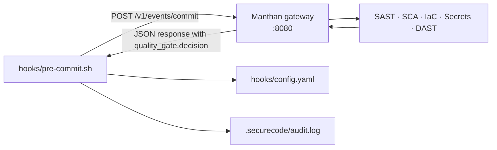

# Manthan Contract

> Manthan is the ASOC (Application Security Orchestration and Correlation) gateway the library expects to satisfy the **scan-before-merge** gate. This document is the **contract**: endpoint definitions, payload examples, exit-code mapping, severity-threshold matrix, and the freshness definition.
>
> Manthan upstream: <https://github.com/arvindiyu/manthan>. **No Manthan code is bundled** with this library. The contract here is what the library's `hooks/pre-commit.sh` (Phase 4) calls; Manthan is responsible for fulfilling it.

## Architecture



The hook is the policy point; Manthan is the orchestration / correlation point; the scanners are the data sources.

## Endpoints

### `GET /healthz`

Health check. Used by `pre-commit.sh` to fail closed when Manthan is unreachable.

**Response (200 OK):**

```json
{
  "status": "ok",
  "version": "x.y.z",
  "uptime_seconds": 12345
}
```

**Response (anything else):** the hook prints an error and exits non-zero.

### `POST /v1/scan`

Initiate an asynchronous scan against arbitrary content. Used for ad-hoc scans (not the pre-commit path).

**Request:**

```json
{
  "scan_id": "uuid-v4-generated-by-caller",
  "scope": {
    "repo": "github.com/example/project",
    "ref": "abc1234",
    "files": ["src/**/*", "package.json"]
  },
  "engines": ["sast", "sca", "iac", "secrets"]
}
```

**Response (202 Accepted):**

```json
{
  "scan_id": "uuid-v4",
  "status": "queued",
  "poll_url": "/v1/scans/uuid-v4"
}
```

Polling the `poll_url` returns the eventual `quality_gate` payload (same shape as `/v1/events/commit` below).

### `POST /v1/events/commit`

**Primary endpoint for the pre-commit hook.** Synchronous; the hook expects a decision within `--timeout` seconds (default 30).

**Request (sent by `hooks/pre-commit.sh`):**

```json
{
  "commit": {
    "sha": "abc1234",
    "branch": "feat/example",
    "author": "dev@example.com",
    "is_ai_assisted": true,
    "co_authored_by": ["Claude <noreply@anthropic.com>"]
  },
  "diff": {
    "files_changed": 12,
    "lines_added": 340,
    "lines_removed": 80,
    "paths": ["src/api.ts", "src/db.ts"]
  },
  "context": {
    "repo": "github.com/example/project",
    "library_version": "1.0.0",
    "config_severity_threshold": "high",
    "config_freshness_window_commits": 10
  },
  "subagent_findings": [
    {
      "subagent_id": "coding-standards-reviewer",
      "tier": "C",
      "findings": [
        {
          "rule_id": "no-hardcoded-secrets",
          "severity": "critical",
          "path": "src/db.ts",
          "line": 42,
          "message": "Potential credential committed to source."
        }
      ]
    }
  ]
}
```

**Response (200 OK):**

```json
{
  "scan_id": "uuid-v4",
  "quality_gate": {
    "decision": "block",
    "rationale": "1 critical SAST + 0 high; threshold=high.",
    "findings_summary": {
      "critical": 1,
      "high": 0,
      "medium": 3,
      "low": 12,
      "info": 5
    },
    "engines_run": ["sast", "sca", "secrets"],
    "engines_skipped": ["iac"],
    "engines_failed": []
  },
  "findings": [
    {
      "id": "manthan-sast-001",
      "rule": "CWE-89",
      "severity": "critical",
      "engine_class": "sast",
      "path": "src/db.ts",
      "line": 42,
      "message": "Likely SQL injection: string concatenation in query."
    }
  ]
}
```

**Decision values:**

| `decision` | Meaning | Hook behaviour |
|---|---|---|
| `pass` | No findings ≥ threshold | Exit 0. |
| `warn` | Findings present but below threshold | Exit 0; print summary; append audit log. |
| `block` | Findings ≥ threshold | Exit non-zero with rationale. |
| `error` | Manthan internal error (scanners failed, etc.) | Exit non-zero; rationale included. |

### `GET /mcp/sse` and `POST /mcp/call`

Manthan exposes its findings catalog and scan capabilities via [Model Context Protocol](https://modelcontextprotocol.io) so that native (Tier A) subagents in an IDE can query it directly. The library's subagents do not require MCP — they go through the pre-commit hook by default — but the endpoints are documented for completeness.

Reference: `mcp-server-safety` rule (Tier 0) defines the consumer-side trust contract for any MCP server, including Manthan's.

## Exit-code mapping

`hooks/pre-commit.sh` maps Manthan responses to POSIX exit codes:

| Exit code | Condition |
|---|---|
| `0` | `decision: pass` OR `decision: warn` (when severity below threshold). |
| `1` | `decision: block` — generic gating failure. |
| `2` | `decision: error` — Manthan internal failure; details on stderr. |
| `3` | Manthan unreachable / `/healthz` not 200. |
| `4` | Schema mismatch — response did not match expected shape. |
| `64` | Hook misuse (bad CLI args). |
| `65` | `hooks/config.yaml` missing or invalid. |
| `78` | One of the seven compliance checks failed before the Manthan call (constitution, spec, sbom, adr, threat-model, freshness, gaps). |

Non-zero exit always emits a single-line SARIF-style summary on stderr plus the human-readable rationale.

## Severity-threshold matrix

The standard matrix, mirroring [SCEC](https://github.com/arvindiyu/SecureCodeEnterpriseControl)-style gating. Lives here so the contract has a single home; `hooks/config.yaml` exposes the threshold as a configurable knob.

| Severity | Merge block | CI fail | SLA (default) | Rationale |
|---|---|---|---|---|
| **CRITICAL** | Yes | Yes | 24 hours | RCE, secret leak, broken auth, supply-chain compromise. |
| **HIGH** | Yes | Yes | 7 days | Exploitable injection, missing authn / authz, weak crypto with realistic attack path. |
| **MEDIUM** | No | No | 30 days | Hardening gaps, defence-in-depth misses, weak crypto without immediate attack path. |
| **LOW / INFO** | No | No | Backlog | Style, documentation, very-low-likelihood findings. |

### Configuring the threshold

`hooks/config.yaml` (Phase 4):

```yaml
severity_threshold: high          # default
# severity_threshold: critical    # OSS / lower-risk projects
# severity_threshold: medium      # regulated workloads (SOX, PCI, HIPAA)
```

Effective behaviour:
- `critical` — only `decision: block` from a critical finding fails the gate. HIGHs warn.
- `high` (default) — critical and high both block. Medium/low warn.
- `medium` — critical, high, and medium block. Low/info warn.
- `low` — everything except `info` blocks. (Not recommended; produces noisy gates.)

### GAPS risk classification

`registry/rules/precommit/gaps-risk-classification.rule.yaml` (Phase 2) maps every Manthan finding to one of C/H/M/L using a deterministic table:

```
GAPS class = f(
  finding.severity,           // C / H / M / L from the scanner
  finding.engine_class,       // sast / sca / iac / secrets / dast
  finding.cwe,                // CWE-XX mapping table
  finding.asvs_control_id,    // ASVS criticality
  context.is_ai_assisted      // raises floor by one band when true
)
```

The `is_ai_assisted: true` flag in the commit event raises the GAPS floor by one band — for example, an otherwise-Medium SAST finding on AI-authored code is treated as High. Rationale: see the Glasswing-era posture section in [`THREAT_MODEL.md`](../THREAT_MODEL.md).

## Freshness definition

Findings have a freshness lifecycle. The library tracks freshness per artefact, not per finding, because findings come and go but artefacts (CONSTITUTION, SPEC, SBOM, ADRs, THREAT_MODEL) must stay current with `HEAD`.

**Definition:** An artefact is **fresh** when its `git log -1 --format=%H -- <artefact>` is within `freshness_window_commits` of `HEAD`.

```yaml
# hooks/config.yaml (Phase 4)
freshness_window_commits: 10     # default (Wave 4 reconciliation: 10 is more practical for active repos)
required_artifacts:
  - SPEC.md
  - sbom.cdx.json
  - docs/adr/        # at least one ADR touched
  - THREAT_MODEL.md
# Note: CONSTITUTION.md is checked unconditionally by Compliance Check 1; not in the freshness rotation.
```

Effective behaviour:
- If `HEAD` is 11+ commits past the last touch of `SPEC.md` or `THREAT_MODEL.md`, the freshness check warns.
- If `HEAD` is 20+ commits past, the freshness check blocks (configurable warning vs blocking distance — Phase 4 defaults documented in `hooks/config.yaml`).
- **CONSTITUTION.md is checked unconditionally by Compliance Check 1**; not in the freshness rotation. Its absence is a hard failure (exit 78), not a freshness warning.
- `sbom.cdx.json` has a tighter window when dependency lockfiles changed: any commit that touches `package-lock.json` / `poetry.lock` / `Cargo.lock` / `go.sum` without a same-commit SBOM regen warns immediately.

For ADRs the freshness check is **coverage-driven**: when any file under `src/` changes, at least one ADR must reference the changed module within the `freshness_window_commits` envelope. This is enforced by `adr-check.rule.yaml`.

## How the hook composes the request

```
1. Parse staged diff (git diff --staged --name-only).
2. Detect AI-attribution (Co-Authored-By trailers in commit message buffer).
3. Run the seven local compliance checks. If any fail with severity ≥ threshold, exit early
   without calling Manthan (exit code 78).
4. Run Tier C subagent runners (ai-governance-auditor, coding-standards-reviewer) against
   staged files. Aggregate findings into the `subagent_findings` array.
5. POST /v1/events/commit with the assembled payload.
6. Parse the response. Apply severity_threshold + GAPS reclassification.
7. Emit audit log entry to .securecode/audit.log (JSON-lines).
8. Exit 0/1/2/3/4 per the table above.
```

## Audit-log emission

Every `/v1/events/commit` call produces one JSON-lines entry:

```json
{
  "timestamp": "2026-06-10T19:42:13Z",
  "subagent_id": "scan-gate",
  "tier": "C",
  "user": "dev@example.com",
  "inputs_hash": "sha256:abc...",
  "model": null,
  "token_in": 0,
  "token_out": 0,
  "decision": "block",
  "finding_count": 4,
  "manthan_scan_id": "uuid-v4",
  "engines_run": ["sast", "sca", "secrets"]
}
```

`model` and `token_in/out` are `null`/0 because the hook itself does not consume LLM tokens (Tier C is deterministic). If a consumer opts into `SECUREAI_LLM_ENDPOINT` for prose remediation, additional audit lines describe that LLM round-trip separately.

## Failure modes and graceful degradation

| Failure | Behaviour |
|---|---|
| Manthan endpoint unreachable | Hook fails closed with exit 3. Operators set `manthan_endpoint: null` to disable locally (only acceptable for personal projects). |
| Manthan returns 500 | Hook fails closed with exit 2. Findings buffered to `.securecode/audit.log` for later re-submission. |
| Scanner timeout | Manthan returns `engines_failed: [<engine>]`. Hook treats as warn (does not block) but logs. Critical-class engines (`secrets`, `sast`) can be configured to block on timeout. |
| Schema drift (Manthan returns unexpected shape) | Hook fails closed with exit 4. CI runs the same assertion in `merge-gate.yml`. |
| Network proxy issues | Use `manthan_endpoint: http://localhost:8080` (loopback) for local; document HTTPS / mTLS for shared deployments. |

## Versioning the contract

Contract versions are pinned per library MAJOR release. A breaking change to the request/response shape requires:

1. A library MAJOR bump per [`SPEC.md`](../SPEC.md) §4.1.
2. An ADR documenting the change (extending ADR 0002).
3. A migration note in `CHANGELOG.md`.
4. A compatible Manthan version range stated in `hooks/config.yaml`.

## References

- Manthan upstream: <https://github.com/arvindiyu/manthan>
- Model Context Protocol: <https://modelcontextprotocol.io/>
- ADR 0002 — Manthan scan-gate contract.
- ADR 0003 — Severity-thresholds policy.
- `hooks/pre-commit.sh` (Phase 4).
- `hooks/config.yaml` (Phase 4).
- `registry/rules/precommit/gaps-risk-classification.rule.yaml` (Phase 2).
