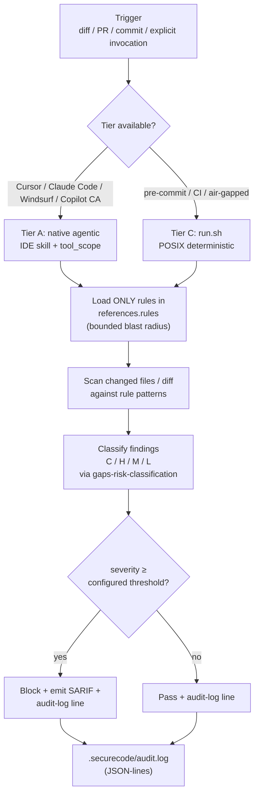
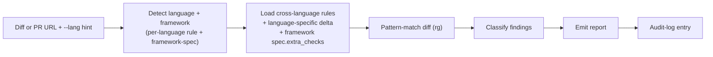
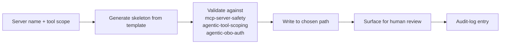
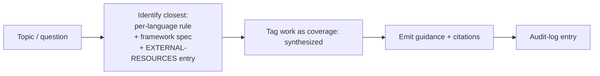

```mermaid
flowchart LR
  accTitle: ai-governance-auditor Tier A flow
  accDescr: Tier A flow for ai-governance-auditor - loads only AI-governance rules in references.rules, scans PR diff for pattern matches, classifies findings, emits explanation, surfaces blocking decisions for review.
  G1["PR diff + repo context"] --> G2["Load ONLY AI-governance rules<br/>in references.rules"]
  G2 --> G3["Pattern-match each rule<br/>against diff (rg)"]
  G3 --> G4["Classify findings (gaps-risk)"]
  G4 --> G5["Emit per-finding explanation<br/>(uses model for prose)"]
  G5 --> G6["Surface blocking decisions<br/>for human review"]
  G6 --> G7["Audit-log entry"]
```

# Subagent Flows

> Per-subagent two-tier execution flows. The library ships **6 subagents** with **two execution tiers**: Tier A (native agentic, inside an IDE) and Tier C (headless deterministic, in pre-commit / CI / air-gapped contexts). **Tier B chat-prompt fallback is deliberately not shipped** — see [ADR 0004](./adr/0004-claim-hygiene-and-sourcing.md) for rationale.
>
> This document is the operational truth for how each subagent runs in each tier. Phase 3 implements `registry/subagents/<id>/subagent.yaml` + `run.sh` per the contract here.

## Tier matrix

| Tier | When used | Mechanism | Token cost | Determinism |
|---|---|---|---|---|
| **A — Native agentic** | Cursor IDE (live), Claude Code (M8), Windsurf (M8), Copilot Coding Agent (issue-assigned) | `subagent.yaml` lowered to per-IDE skill format; agent loads `tool_scope.allowed` + iterates against the user query | High (prompt + context + output) | Best-effort; output depends on model |
| **B — Chat prompt fallback** | (not shipped) | — | — | — |
| **C — Headless / rule-based** | pre-commit, CI, air-gapped | `run.sh` — deterministic POSIX runner using `rg`/`yq`/`jq` against `references.rules`; optional `SECUREAI_LLM_ENDPOINT` only for prose | Zero by default; opt-in LLM for prose remediation only | Fully deterministic gate decisions; LLM never overrides a block |

### Why no Tier B

Tier B would be hand-authored chat prompts (e.g., `prompts/_subagent-templates/<id>.md`) that a Copilot Chat user copy-pastes. We reject this tier because:

1. The prompts would duplicate canonical content from `subagent.yaml` — a maintenance hazard.
2. Tier A already covers interactive use through IDE skills.
3. Tier C already covers automation through `run.sh`.
4. Copilot Chat users have two compliant fallbacks today: read the generated `.cursor/skills/<id>/SKILL.md` (which Cursor renders from the same canonical source), or invoke the Tier C runners via a terminal alias.

Recorded in ADR 0004.

## Canonical flow (all six subagents share this shape)



The single-source-of-truth invariant: every subagent declares its `tiers`, `tool_scope`, `token_budget`, `audit_log`, and `references.rules` in its `subagent.yaml`. Adapters lower from this single file; runners execute from it. There is no separate skills tree, no separate chat-prompt tree, no hidden state.

---

## The six subagents

### 1. `adr-author`

Drafts an Architectural Decision Record from a code diff or PR URL.

**Tier A — Native (Cursor / Claude Code / Windsurf / Copilot Coding Agent)**

```mermaid
flowchart LR
  accTitle: adr-author Tier A flow
  accDescr: Tier A flow for adr-author - reads diff, summarizes context, drafts MADR sections (Status, Context, Decision, Consequences), surfaces for human approval, writes file to docs/adr/.
  A1["Diff or PR URL"] --> A2["Read tool_scope<br/>(read_file, grep, glob)"]
  A2 --> A3["Summarize context from diff"]
  A3 --> A4["Draft MADR sections"]
  A4 --> A5["Surface for human approval<br/>(agentic-human-approval)"]
  A5 --> A6["Write docs/adr/NNNN-<slug>.md"]
  A6 --> A7["Audit-log entry"]
```



**Tier C — Headless (`registry/subagents/adr-author/run.sh`)**

Generates a template-filled ADR from diff statistics + `git log`. Zero LLM cost. Output: SARIF + a draft `.md` file (not committed; the developer reviews).

| Token budget (system + context + output) | 1.5K + 8K + 2K |
| Tool scope (allowed) | `read_file`, `grep`, `glob`, `write_markdown_under_docs_adr` |
| Tool scope (denied) | `shell`, `network`, `write_any_other_path` |
| Classification | medium-impact |
| Human approval | required before commit |

---

### 2. `threat-modeler`

Generates a STRIDE or PASTA threat model from a repository's architecture.

**Tier A — Native**



```mermaid
flowchart LR
  accTitle: threat-modeler Tier A flow
  accDescr: Tier A flow for threat-modeler - walks repo for trust boundaries, identifies data flows, applies STRIDE per boundary, emits Mermaid diagram and checklist, surfaces for review.
  T1["Repo + optional scope hint"] --> T2["Walk for trust boundaries<br/>(network, auth, persistence, IPC)"]
  T2 --> T3["Identify data flows"]
  T3 --> T4["Apply STRIDE per boundary"]
  T4 --> T5["Emit Mermaid diagram<br/>+ threat catalog table"]
  T5 --> T6["Surface for human review"]
  T6 --> T7["Optionally write THREAT_MODEL.md"]
  T7 --> T8["Audit-log entry"]
```

The Mermaid output is **also the single source of truth** for diagrams in this library — Phase 5 dropped the standalone "diagram generator" prompt because `threat-modeler` already emits it.

**Tier C — Headless**

Walks the repo for trust-boundary indicators (`@RestController`, `Express()`, `Flask()`, `package.json` `dependencies`, `requirements.txt`, etc.). Emits a checklist + Mermaid diagram. Zero LLM cost.

| Token budget (system + context + output) | 2K + 10K + 3K |
| Tool scope (allowed) | `read_file`, `grep`, `glob`, `write_markdown_under_threat_model` |
| Tool scope (denied) | `shell`, `network`, `write_any_other_path` |

---

### 3. `ai-governance-auditor`

Audits a PR against AI-governance rules (the 20+ baseline rules + 2 Mythos-era).

**Tier A — Native**



**Tier C — Headless**

Same as Tier A minus the prose explanation. Emits SARIF findings; LLM only invoked if `SECUREAI_LLM_ENDPOINT` is set, and only for prose remediation per finding.

| Token budget (system + context + output) | 1.5K + 12K + 4K |
| Tool scope (allowed) | `read_file`, `grep`, `glob`, `write_sarif_to_stdout` |
| Tool scope (denied) | `shell`, `network` (except `$SECUREAI_LLM_ENDPOINT` when set), `write_any_other_path` |

---

### 4. `coding-standards-reviewer`

Per-language and framework-spec-aware review.

**Tier A — Native**



**Tier C — Headless**

`rg`-based pattern matches from `applicable_rules` (per the framework spec) + cross-language parent rules via `extends:`. Zero LLM cost.

| Token budget (system + context + output) | 1.5K + 12K + 4K |
| Tool scope (allowed) | `read_file`, `grep`, `glob`, `write_sarif_to_stdout` |
| Tool scope (denied) | `shell`, `network` (except `$SECUREAI_LLM_ENDPOINT` when set), `write_any_other_path` |

---

### 5. `mcp-builder`

Scaffolds a Model Context Protocol server conforming to the safety rules.

**Tier A — Native**



**Tier C — Headless**

Same project-skeleton generation; emits validation checklist as SARIF.

| Token budget (system + context + output) | 2K + 8K + 5K |
| Tool scope (allowed) | `read_file`, `grep`, `glob`, `write_files_under_user_specified_dir` |
| Tool scope (denied) | `shell`, `network`, `write_any_other_path` |

---

### 6. `secure-developer-mentor`

The catch-all pair-programmer. Catches topics that aren't in the registry.

**Tier A — Native**



**Tier C — Headless: `not_applicable`**

This subagent is **interactive only**. There is no useful headless mode — its value is in interactive synthesis across uncovered topics. Its `subagent.yaml` declares `tiers.headless: not_applicable` and the CI cross-link lint accepts that value.

| Token budget (system + context + output) | 1.5K + 10K + 3K |
| Tool scope (allowed) | `read_file`, `grep`, `glob`, `write_markdown_to_pr_comment` |
| Tool scope (denied) | `shell`, `network`, `write_any_other_path` |

---

## Subagent invocation matrix

| Subagent | Cursor (Tier A) | Copilot Coding Agent (Tier A) | AGENTS.md (Tier A) | Headless (Tier C) |
|---|---|---|---|---|
| `adr-author` | `@adr-author <diff>` | Issue with label `subagent:adr-author` | "Invoke `adr-author` on `<diff>`" | `registry/subagents/adr-author/run.sh` |
| `threat-modeler` | `@threat-modeler` | Issue with label `subagent:threat-modeler` | "Invoke `threat-modeler`" | `registry/subagents/threat-modeler/run.sh` |
| `ai-governance-auditor` | `@ai-governance-auditor` | Auto-run on every PR with label `area:ai-governance` | "Invoke `ai-governance-auditor`" | `registry/subagents/ai-governance-auditor/run.sh` |
| `coding-standards-reviewer` | `@coding-standards-reviewer --lang=<lang>` | Auto-run on every PR | "Invoke `coding-standards-reviewer --lang=<lang>`" | `registry/subagents/coding-standards-reviewer/run.sh` |
| `mcp-builder` | `@mcp-builder` | Issue with label `subagent:mcp-builder` | "Invoke `mcp-builder`" | `registry/subagents/mcp-builder/run.sh` |
| `secure-developer-mentor` | `@secure-developer-mentor` | (not applicable; interactive) | "Invoke `secure-developer-mentor`" | n/a |

## Subagent contract reference

For the formal schema, see [`registry/schemas/subagent.schema.json`](../registry/schemas/subagent.schema.json). Required fields:

- `metadata.id` — kebab-case; matches the directory name under `registry/subagents/`.
- `metadata.name` — human-readable.
- `tiers.native` — declares per-IDE invocation patterns (`cursor:`, `agents_md:`, `copilot_coding_agent:`, optionally `claude_code:` and `windsurf:` from M8).
- `tiers.headless` — declares the runner path + `deps:` + optional `optional_llm_env:` + `output_format:`. Or the literal value `not_applicable`.
- `token_budget.input_max`, `token_budget.output_max`, `token_budget.warn_at` (percentage, default 0.8).
- `audit_log.enabled` (default `true`) + `audit_log.path` (default `.securecode/audit.log`).
- `tool_scope` — `allowed: [...]` and `denied: [...]`.
- `references.rules` — closed list of rule IDs this subagent will load.

## Audit-log invariant

Every Tier A and Tier C invocation MUST append one JSON-lines entry to `.securecode/audit.log`:

```json
{
  "timestamp": "2026-06-10T19:42:13Z",
  "subagent_id": "ai-governance-auditor",
  "tier": "C",
  "user": "dev@example.com",
  "inputs_hash": "sha256:abc...",
  "model": null,
  "token_in": 0,
  "token_out": 0,
  "decision": "block",
  "finding_count": 3
}
```

Tier C runners emit `model: null` and `token_in/out: 0` by default. When `$SECUREAI_LLM_ENDPOINT` is set, the runner emits an additional line for the LLM round-trip, with `model` set to the endpoint identifier.

## References

- [`docs/AI-CONTROL-MAP.md`](./AI-CONTROL-MAP.md) — which subagent governs which SDLC stage.
- [`docs/TOKEN-ECONOMICS.md`](./TOKEN-ECONOMICS.md) — token-budget rationale and enforcement.
- [`docs/MANTHAN-CONTRACT.md`](./MANTHAN-CONTRACT.md) — how subagent findings feed the scan-gate.
- [`registry/schemas/subagent.schema.json`](../registry/schemas/subagent.schema.json) — formal contract.
- ADR 0001 — Registry and adapter architecture.
- ADR 0004 — Claim hygiene and sourcing (rationale for dropping Tier B).
- ADR 0005 — Token economy architecture.
