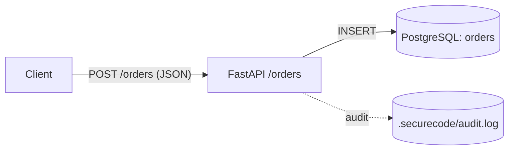

# threat-modeler — expected output (happy path)

## Tier C SARIF on stdout

```json
{
  "$schema": "https://json.schemastore.org/sarif-2.1.0.json",
  "version": "2.1.0",
  "runs": [
    {
      "tool": {
        "driver": {
          "name": "threat-modeler",
          "version": "1.0.0",
          "informationUri": "https://github.com/arvindiyu/SecureAICodeLibrary",
          "rules": [
            {
              "id": "MISSING_THREAT_MODEL",
              "name": "MissingThreatModelUpdate",
              "shortDescription": { "text": "Trust-boundary change without an accompanying THREAT_MODEL.md update." },
              "helpUri": "registry/rules/policies/required-artifacts.rule.yaml"
            }
          ]
        }
      },
      "results": [
        {
          "ruleId": "MISSING_THREAT_MODEL",
          "level": "error",
          "message": {
            "text": "Trust-boundary change detected (new-http-endpoint,new-persistence) but THREAT_MODEL.md was not touched in this diff."
          },
          "locations": [
            { "physicalLocation": { "artifactLocation": { "uri": "THREAT_MODEL.md" } } }
          ],
          "properties": {
            "suggested_diagram": "flowchart LR\n  accTitle: Proposed data-flow for new trust boundary\n  accDescr: Skeleton DFD generated by threat-modeler. Replace placeholders before merging into THREAT_MODEL.md.\n  Client[\"Client\"] -->|\"request\"| Boundary[\"NEW boundary\"]\n  Boundary -->|\"data\"| Persistence[(\"Persistence\")]\n  Boundary -.->|\"audit\"| Log[(\"Audit log\")]\n",
            "suggested_stride_entries": "| STRIDE | Threat | Mitigation |\n|---|---|---|\n| Spoofing | Caller identity unverified at new boundary. | Require auth (see `agentic-obo-auth`). |\n..."
          }
        }
      ]
    }
  ]
}
```

## Audit-log line appended to `.securecode/audit.log`

```json
{"timestamp":"2026-06-10T19:42:13Z","subagent_id":"threat-modeler","tier":"C","user":"dev","inputs_hash":"sha256:abc...","model":null,"token_in":0,"token_out":0,"decision":"block","finding_count":1}
```

## Exit code

`1` (blocking finding).

## Tier A delta surfaced for human approval

````markdown
### Boundary: POST /orders → orders DB (new)



| STRIDE | Threat | Mitigation |
|---|---|---|
| Spoofing | Endpoint accepts unauthenticated POSTs. | Add JWT verification and on-behalf-of token exchange (`agentic-obo-auth`). |
| Tampering | `payload: dict` is unvalidated. | Schema-validate via Pydantic; cite `coding-standards/input-validation`. |
| Repudiation | No audit log on writes. | Emit `.securecode/audit.log` per `ai-audit-logging`. |
| Information disclosure | `orders` likely contains PII (customer name, address). | Classify per `ai-data-classification`; encrypt at rest. |
| Denial of service | No rate limit. | Add per `ai-rate-limiting` (or framework-level limiter). |
| Elevation of privilege | Handler uses a long-lived DB session with broad grants. | Tighten per `agentic-tool-scoping` and least-privilege role. |

> Glasswing-era posture: this endpoint is reachable by AI-assisted callers; raise the GAPS floor by one band per `THREAT_MODEL.md` Glasswing-era section.
````
